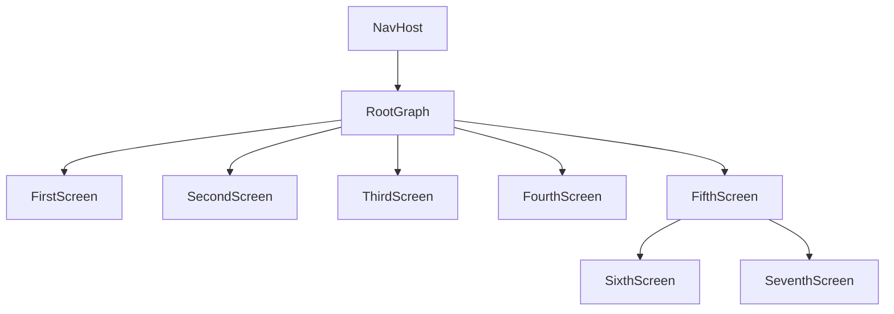
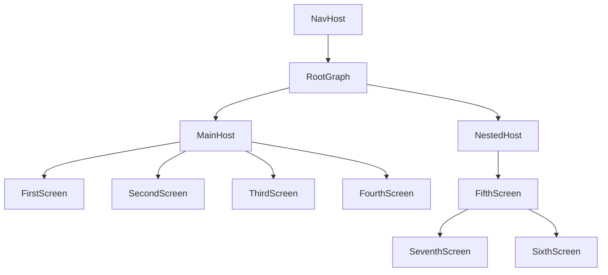

# JetpackCompose Navigation

This is a Kotlin Multiplatform project targeting Android and iOS where I will showcase the JetpackCompose as the app
navigation. Since the navigation is moved from android to multiplatform project we definitely should give it a
try [link](https://www.jetbrains.com/help/kotlin-multiplatform-dev/compose-navigation-routing.html).

Assumptions:

- Application should allow us to navigate from one screen to another.
- Application should allow to pass some parameters from first to second screen.
- Application should handle the screen rotation without loosing data.
- Application should handle the Tab Navigation.
- Application should handle the async operations with coroutines.

In the next posts I will also cover
the [Voyager](https://github.com/mkonkel/VoyagerNavigation), [Apyx](https://github.com/mkonkel/AppyxNavigation) and
[Decompose](https://github.com/mkonkel/DecomposeNavigation) navigation libraries.

### The project:

Base project setup as always is made with [Kotlin Multiplatform Wizard](https://kmp.jetbrains.com), we also need to add
some [navigation-compose](https://developer.android.com/develop/ui/compose/navigation) as it is the core
thing that we would like to examine, according to
the [documentation](https://www.jetbrains.com/help/kotlin-multiplatform-dev/compose-navigation-routing.html#sample-project)
we should use `navigation` in version `2.7.0-alpha07`

*libs.versions.toml*

```toml
[versions]
navigation-compose = "2.7.0-alpha07"

[libraries]
navigation-compose = { module = "org.jetbrains.androidx.navigation:navigation-compose", version.ref = "navigation-compose" }
```

Freshly added dependencies needs to be synced with the project and added to the ***build.gradle.kts***

```kotlin 
plugins {
    alias(libs.plugins.kotlinSerialization)
}

sourceSets {
    commonMain.dependencies {
        ...
        implementation(libs.navigation.compose)
    }
}
```

> Note:
>
> The recent release
> of [JetpackNavigation](https://developer.android.com/jetpack/androidx/releases/navigation#2.8.0-alpha08)
> adds `Safe Args`
> which is a convenient way of defining routes with usage
> of  [Kotlin Serialization](https://kotlinlang.org/docs/serialization.html) - but it's not available yet in compose
> multiplatform `1.6.11`. I hope it changes soon, but for now we need to define routes as plain strings.
>
>Each version of `Compose Multiplatform` is built with different dependencies, and it's at least one version behind
> the `JetpackCompose` for Android. If you are interested what is in the latest
> release [1.6.11](https://github.com/JetBrains/compose-multiplatform/releases/tag/v1.6.11) please check the
> documentation. To mitigate the Type Safety routing we will be using a `sealed class` with string parameter.

### Linear Navigation

Getting started. The question is how do the navigation know where to go - it's simple, every destination has its own
unique `route` (that can be simply described as a URL address) that defines current screen. The destination in most
cases will be a composable function that will be displayed on the screen.

```kotlin
sealed class Screen(val route: String) {
    data object FirstScreen : Screen("firstScreen")
    data object SecondScreen : Screen("secondScreen")
}
```

Now we can create the `Navigation` composable function. Which will hold the `NavHost` and `navigationController`.
The `NavHost` is the container for displaying the current destination and the `navigationController` is the object that
manages the navigation between destinations (screens). The last thing is the `NavGraph` that maps composable
destinations and routes.

```kotlin
@Composable
fun Navigation() {
    val navController = rememberNavController()

    NavHost(
        navController = navController,
        startDestination = Screen.FirstScreen.route
    ) {
        composable(route = Screen.FirstScreen.route) {
            ...
        }
        composable(route = Screen.SecondScreen.route) {
            ...
        }
    }
}
```

With the frame built we should implement some screens. The `FirstScreen` will be a simple screen with a button that will
navigate to the `SecondScreen`.

```kotlin
@Composable
fun FirstScreen() {
    Column(
        modifier = Modifier.fillMaxSize(),
        horizontalAlignment = Alignment.CenterHorizontally,
        verticalArrangement = Arrangement.Center
    ) {
        Text("First screen")
        Button(onClick = { /*TODO navigate to the second screen*/ }) {
            Text("Second Screen")
        }
    }
}
```

```kotlin
@Composable
fun SecondScreen() {
    Column(
        modifier = Modifier.fillMaxSize(),
        horizontalAlignment = Alignment.CenterHorizontally,
        verticalArrangement = Arrangement.Center
    ) {
        Text("Second screen")
        Spacer(modifier = Modifier.height(16.dp))
        Button(onClick = { /*TODO navigate back to first screen*/ }) {
            Text("Go Back")
        }
    }
}
```

Now fill the gaps in `Navigation()` function with created screens.
We left some TODOs in the screens. If we want to navigate from screen to screen we need to pass the `navConroler` as an
input to our composable and then call `navigate()` method and `popBackStack()` to go back.

```kotlin
Button(onClick = { navController.navigate(Screen.SecondScreen.route) }) { Text("Second Screen") }
```

```kotlin
Button(onClick = { navController.popBackStack() }) { Text("Go Back") }
```

After all that we neet to use our `Navigation()` function in the application entrypoint, for andorid it is
the `MainActivity.kt` and for iOS it is the `MainViewController.kt`.

```kotlin
class MainActivity : ComponentActivity() {
    override fun onCreate(savedInstanceState: Bundle?) {
        super.onCreate(savedInstanceState)

        setContent {
            Navigation()
        }
    }
}
```

```kotlin
fun MainViewController() = ComposeUIViewController { Navigation() }
```

After running the application we should see the `FirstScreen` with a button that navigates to the `SecondScreen` and a
button that navigates back to the `FirstScreen`.


### Passing parameters

> Note:
>
> The recent release
> of [JetpackNavigation](https://developer.android.com/jetpack/androidx/releases/navigation#2.8.0-alpha08)
> adds `Safe Args`
> which is a convenient way of passing parameters. Which is not available yet in compose multiplatform `1.6.11`.

There are two types of arguments **required*** and **optional**, optionals should be created with a default value. As
said at the beginning the route looks like the URL address, so we will be passing the parameters as a parts of the
route. We can pass a single or a multiple arguments.
Required arguments should be passed as a `path` in route. Let's create third screen that will accept the `greetings`
parameter.

#### Required Arguments

```kotlin
sealed class Screen(val route: String) {
    ...
    data object ThirdScreen : Screen("thirdScreen/{greetings}")
}
```

Now we need to create the `ThirdScreen` composable function that will accept the `greetings` parameter and provide a way
to pass the arguments.
Since `safe args` are not there, we need to use `NavArgumentBuilder` and explicit define the type of the argument and of
course provide the key for it.

```kotlin
@Composable
fun Navigation() {
    NavHost(...) {
        ...
        composable(
            route = Screen.ThirdScreen.route,
            arguments = listOf(navArgument("greetings") {
                type = NavType.StringType
            })
        ) {
            ThirdScreen(navController)
        }
    }
}
```

Let's modify the `FirstScreen` to navigate to the `ThirdScreen` with the greetings parameter.

```kotlin
@Composable
fun FirstScreen(navController: NavHostController) {
    ...
    Button(
        onClick = {
            val greetings = "Hello from First Screen"
            navController.navigate("thirdScreen/$greetings")
        }
    ) {
        Text("Third Screen")
    }
}
} 
```

We have got the function to call a screen with the argument, now we need to extract the argument from the route and pass
it to the `ThirdScreen` composable.
We need to modify the `ThirdScreen` to accept the `greetings` parameter, and `Navigation` to extract the argument from
the route.

```kotlin
        composable(...) {
    ThirdScreen(navController, it.arguments?.getString("greetings").orEmpty())
}
```

```kotlin
@Composable
fun ThirdScreen(navController: NavHostController, greetings: String) {
    Column(
        modifier = Modifier.fillMaxSize(),
        horizontalAlignment = Alignment.CenterHorizontally,
        verticalArrangement = Arrangement.Center
    ) {
        Text("Third screen")
        Spacer(modifier = Modifier.height(16.dp))
        Text("Greetings: $greetings")
        Spacer(modifier = Modifier.height(16.dp))
        Button(onClick = { navController.popBackStack() }) {
            Text("Go Back")
        }
    }
}
```


There is always place for improvement, we can adjust the `Screen` class to use some const values and functions to help
us with providing right paths and extracting the arguments instead of writing them manually one by one.

```kotlin
sealed class Screen(val route: String) {
    ...
    data object ThirdScreen : Screen(route = "thirdScreen/{${ARGUMENTS.GREETING}}") {
        fun withGreetings(greeting: String) = route.replaceArgumentWithValue(ARGUMENTS.GREETING, greeting)

        object ARGUMENTS {
            const val GREETING = "greeting"
        }
    }

    internal fun String.replaceArgumentWithValue(argument: String, value: String) = this.replace("{$argument}", value)
}
```

We have got a basic route with a single argument, but what if we want to pass multiple arguments? We need to follow same
rules as with one argument - just extend the route with more parts and handle them in `Navigation` and in the desired
screens.

#### Optional Arguments

For optional arguments we will follow same idea as with required arguments. They should be passed as query in the URL
address. They should be preceded by a `?` character and follow the pattern `?key=value`, and if you want to pass
multiple optional parameters they have to be separated with `&` character `?key1=value1&key2=value2`.
You need to remember that for optional argument you need to provide a default value or mark argument as nullable
Let's create the `FourthScreen` that will accept the optional `name` and optional (but nullable) `surname` parameters.

```kotlin
data object FourthScreen : Screen(
    route = "fourthScreen"
            + "?${ARGUMENTS.NAME}={${ARGUMENTS.NAME}}"
            + "&${ARGUMENTS.SURNAME}={${ARGUMENTS.SURNAME}}"
) {
    fun withName(name: String) = route.replaceArgumentWithValue(ARGUMENTS.NAME, name)

    fun withNameAndSurname(name: String, surname: String) = route
        .replaceArgumentWithValue(ARGUMENTS.NAME, name)
        .replaceArgumentWithValue(ARGUMENTS.SURNAME, surname)

    object ARGUMENTS {
        const val NAME = "name"
        const val SURNAME = "surname"
    }
}
```

```kotlin
composable(
    route = Screen.FourthScreen.route,
    arguments = listOf(
        navArgument(Screen.FourthScreen.ARGUMENTS.NAME) {
            type = NavType.StringType
            defaultValue = ""
        },
        navArgument(Screen.FourthScreen.ARGUMENTS.SURNAME) {
            type = NavType.StringType
            defaultValue = null
            nullable = true
        },
    )
) {
    FourthScreen(
        navController,
        requireNotNull(it.arguments?.getString(Screen.FourthScreen.ARGUMENTS.NAME)),
        it.arguments?.getString(Screen.FourthScreen.ARGUMENTS.SURNAME),
    )
}
```

```kotlin
fun FirstScreen(navController: NavHostController) {
    ...
    Button(
        onClick = {
            navController.navigate(Screen.FourthScreen.withNameAndSurname("John", "Doe"))
        }
    ) {
        Text("John Doe Screen")
    }

    Button(
        onClick = {
            navController.navigate(Screen.FourthScreen.withName("Michael"))
        }
    ) {
        Text("Michael Screen")
    }
}
```

The FourthScreen should be built in a same way as ThordScreen with proper parameters passed.


### Nested Navigation

In case of complex applications splitting navigation into smaller parts is a good idea. Currently, we have one `NavHost`
with all screens originating from the same place.
Which is not a problem for a small application, but in case of a bigger one it can be a mess. We can split the
navigation into smaller parts that will be encapsulated according to their purpose.
We can create a `Fifth` and `Sixth` screen that will separate from main navigation and will be accessible only from
the `ThirdScreen`. The graph for such screens will look like this:



With such structured navigation we can easily manage the navigation and the screens. We can create a `NestedNavigation`
composable function that will hold the `NavHost` and `navigationController` for the nested navigation.
Closing the `ThirdScreen` will trigger removing all its children from the backstack and they won;t be accessible
anymore. It's a great tool for structuring processes in the application - when a process is finished (a signup, a
payment, a tutorial) we can close the process and remove all its children from the backstack easily.

> If you read my post about navigation [Decompose](https://github.com/mkonkel/DecomposeNavigation) you can see
> similarities in the approach. In Decompose every component can have its own stack and manage it.

Adding nested navigation graph is done by using the `navigation()` function in the `NavHost` composable.
The `navigation()` function takes the `startDestination` and the `route`. The `route` is a unique name of the nested
navigation graph to distinguish it from other graphs. The `startDestination` is the screen that will be displayed when
the nested graph is opened.
We can also add the `route` parameter to `NavHost` to be cristal clear which screen is where.

```kotlin 
private object ROUTE {
    const val ROOT = "root"
    const val NESTED = "nested"
    const val MAIN = "main" // will be used in a while
}

@Composable
fun Navigation() {

    NavHost(
        navController = navController,
        startDestination = Screen.FirstScreen.route,
        route = ROUTE.ROOT
    ) {
        ...
        navigation(
            startDestination = Screen.ThirdScreen.route,
            route = ROUTE.NESTED
        ) {
            composable(route = Screen.FifthScreen.route) {
                FifthScreen(navController)
            }

            composable(route = Screen.SixthScreen.route) {
                SixthScreen(navController)
            }
        }
    }
}
```

To clarify the navigation we can split the `Navigation()` function into separate components. One handling `home` and
second handling `nested` graphs.
To do so we need to create extension functions for `NavGraphBuilder` that will result in graph changes:



```kotlin
fun NavGraphBuilder.nested(navController: NavHostController) {
    navigation(
        startDestination = Screen.ThirdScreen.route,
        route = ROUTE.NESTED
    ) {
        // code for nested navigation
    }
}
```

```kotlin
fun NavGraphBuilder.main(navController: NavHostController) {
    navigation(
        startDestination = Screen.SixthScreen.route,
        route = ROUTE.MAIN
    ) {
        // code for main navigation
    }
}
```

```kotlin
@Composable
fun Navigation() {
    val navController = rememberNavController()

    NavHost(
        navController = navController,
        startDestination = ROUTE.MAIN,
        route = ROUTE.ROOT
    ) {
        main(navController)
        nested(navController)
    }
}
```

```kotlin
fun FirstScreen(navController: NavHostController) {
    ...
    Button(
        onClick = {
            navController.navigate(ROUTE.NESTED)
        }
    ) {
        Text("Nested")
    }
}
```

With such changes we still can navigate between graphs. There is no problem calling the `FourtsScreen` from nested
graph. The `SixthScreen` will open a `FourthScreen`.

```kotlin
@Composable
fun SixthScreen(navController: NavHostController) {
    ...
    Button(
        onClick = {
            navController.navigate(Screen.FourthScreen.withNameAndSurname("John", "Doe"))
        }
    ) {
        Text("John Doe Screen")
    }
}
}
```

We can now modify the `FourthScreen` and add a button that will navigate back to `MAIN` route instead of the popping
back the stack.
But we would like to close the `NESTED` graph and remove all its children from the backstack, so we will not navigate to
the screen but to the graph route.
The `navigate()` builder has a `popUpTo` method that allows us to remove the screens from the backstack. We can pass the
route to which we want to pop back to. There is also the `inclusive` parameter to remove the passed route from the
backstack - but we will not use it in this example.

```kotlin
@Composable
fun FourthScreen(...) {
    ...
    Button(
        onClick = {
            navController.navigate(ROUTE.MAIN) {
                popUpTo(ROUTE.MAIN) // results in closing the NESTED graph
            }
        }
    ) {
        Text("MAIN")
    }
}
}
```

We can close the `NESTED` graph even quicker, while opening the `FourthScreen` from the `SixthScreen` all we need to do
is use `popUpTo()` method with the `ROUTE.NESTED` parameter.

```kotlin
@Composable
fun SixthScreen(...) {
    ...
    Button(onClick = {
        navController.navigate(Screen.FourthScreen.withNameAndSurname("John", "Doe")) {
            popUpTo(ROUTE.NESTED)
        }
    }) {
        Text("John Doe Screen")
    }
}
}
```

You can mix the functions as much as you want to achieve desired behaviour. You can `pop` screen before entering a new
one, drop whole graphs and more - it;s a flexible solution.


### Bottom Navigation

Yet another thing that is widely common in mobile apps nowadays is the bottom navigation. Let's extend the project with
one more feature!  We need to add three new screens. `EighthScreen` which will be the main screen that holds bottom
menu, and it's a container for the tabs `NinthScreen` and `TenthScreen`.
Inside the `EighthScreen` we will add a new `NavHost` that will build its own graph and will be handling switching tabs.
We will be also using the `BottomNavigation` control to create the bottom bar and it's items.

```kotlin
@Composable
fun EighthScreen() {
    val navController = rememberNavController()

    Scaffold(
        modifier = Modifier.fillMaxSize(),
        bottomBar = {
            // TODO: add bottom navigation
        },
    ) { innerPadding ->
        NavHost(
            modifier = Modifier.padding(innerPadding),
            navController = navController,
            startDestination = Screen.Tab.NinthScreen.route,
        ) {
            composable(route = Screen.Tab.NinthScreen.route) {
                NinthScreen()
            }

            composable(route = Screen.Tab.TenthScreen.route) {
                TenthScreen()
            }
        }
    }
}
```

The nev `NavHost` has its own `navController` and `startDestination`. When we enter the item displayed in the first tab
will be always the `NinthScreen`.
The local `navController` will be used to navigate between tabs. The `BottomNavigation` control its quite helpful it
will render the bottom bar with necessary elements such as **icon**, **label** and **selected** state.
But to do so we need to provide the info about the tabs. Like in every other type of navigation the displayed screens
need their own `route`, so we can to create a new `sealed class` for the tabs inside current `Screen.kt`

```kotlin
    sealed class Screen(val route: String) {
    ...
    data object EighthScreen : Screen(route = "eighthScreen")
    sealed class Tab(route: String, val icon: ImageVector, val label: String) : Screen(route) {
        data object NinthScreen : Tab(route = "ninthScreen", icon = Icons.Default.Home, label = "Ninth")
        data object TenthScreen : Tab(route = "tenthScreen", icon = Icons.Default.Edit, label = "Tenth")
    }
}
```

Now we can create the bottom navigation tabs.

```kotlin
@Composable
fun BottomBar(navController: NavHostController) {
    val tabs = listOf(
        Screen.Tab.NinthScreen,
        Screen.Tab.TenthScreen,
    )

    val backstackEntry by navController.currentBackStackEntryAsState()
    val currentDestination = backstackEntry?.destination

    BottomNavigation {
        // TODO add UI representation of the bottom menu items that will change the tabs
    }
}
```

The `BottomBar` is a composable responsible for handling the elements inside tabs container. We need to specify the
elements (in our case `tabs`) that are available in the bottom bar. We are also using
the `currentBackStackEntryAsState()` to get the current destination - the value is updated with every `navControler`
changes due to `navigate()` or `pop()` functions which are triggering the recomposition, as a result the top entry on
the backstack is returned - so we will know what is currently displayed, and can retrieve the `destination` that
contains a `route` and other information about the screen.

The `BottomNavigation` control takes a few of parameters, and the last one is the `content` that will be displayed in
the bottom navigation items - so for each tab that we want to display we should create proper UI element.
We can create an extension function for `RowScope` that will create the `BottomNavigationItem` for each tab and provide
necessary data.

```kotlin
@Composable
fun RowScope.TabItem(
    tab: Screen.Tab,
    currentDestination: NavDestination?,
    navController: NavHostController,
) {
    BottomNavigationItem(
        icon = { Icon(imageVector = tab.icon, contentDescription = "navigation_icon_${tab.label}") },
        label = { Text(tab.label) },
        selected = currentDestination?.hierarchy?.any { it.route == tab.route } == true,
        onClick = {
            navController.navigate(tab.route) {
                navController.graph.startDestinationRoute?.let { popUpTo(it) }
                launchSingleTop = true
            }
        },
    )
}
```

The `BottomNavigationItem` allow us to customize the view of the tab. We can provide the `icon`, `label`, `selected`
state and `onClick` action.
The `selected` state is calculated by checking if the current destination is the same as the tab route of the item.
The `onClick` action is responsible for navigating to the clicked tab.

Since we want only one active screen inside the tabs container we need `pop` to it causing dropping other element from
the back stack. We can also add the `launchSingleTop` which will ensure that the is not preserved, and will be
recreated.

Wrapping things up, we should have the `EighthScreen` built like that

```kotlin
@Composable
fun EighthScreen() {
    val navController = rememberNavController()

    Scaffold(
        modifier = Modifier.fillMaxSize(),
        bottomBar = {
            BottomBar(navController)
        },
    ) { innerPadding ->
        NavHost(
            modifier = Modifier.padding(innerPadding),
            navController = navController,
            startDestination = Screen.Tab.NinthScreen.route,
        ) {
            composable(route = Screen.Tab.NinthScreen.route) {
                NinthScreen()
            }

            composable(route = Screen.Tab.TenthScreen.route) {
                TenthScreen()
            }
        }
    }
}

@Composable
fun BottomBar(navController: NavHostController) {
    val tabs = listOf(
        Screen.Tab.NinthScreen,
        Screen.Tab.TenthScreen,
    )

    val backstackEntry by navController.currentBackStackEntryAsState()
    val currentDestination = backstackEntry?.destination

    BottomNavigation {
        tabs.forEach { tab ->
            TabItem(tab, currentDestination, navController)
        }
    }
}

@Composable
fun RowScope.TabItem(
    tab: Screen.Tab,
    currentDestination: NavDestination?,
    navController: NavHostController,
) {
    BottomNavigationItem(
        icon = { Icon(imageVector = tab.icon, contentDescription = "navigation_icon_${tab.label}") },
        label = { Text(tab.label) },
        selected = currentDestination?.hierarchy?.any { it.route == tab.route } == true,
        onClick = {
            navController.navigate(tab.route) {
                navController.graph.startDestinationRoute?.let { popUpTo(it) }
                launchSingleTop = true
            }
        },
    )
}
```

Last thing to do is to add an entrypoint in the `main` graph.

```kotlin
fun NavGraphBuilder.main(navController: NavHostController) {
    ...
    composable(route = Screen.EighthScreen.route) {
        EighthScreen()
    }
}
```


