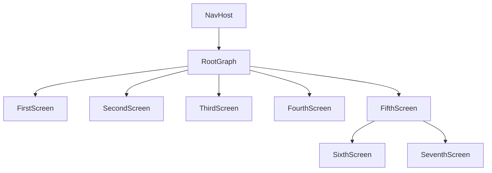
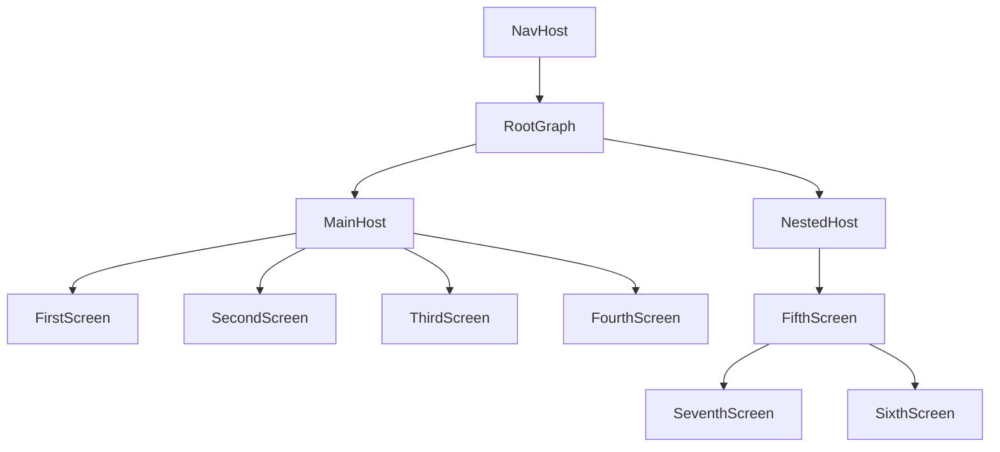

# JetpackCompose Navigation

This is a Kotlin Multiplatform project targeting Android and iOS where I will showcase the JetpackCompose as the app
navigation. Since the navigation is moved from android to multiplatform project we definitely should give it a
try [link](https://www.jetbrains.com/help/kotlin-multiplatform-dev/compose-navigation-routing.html).

Assumptions:

- Application should allow us to navigate from one screen to another.
- Application should allow to pass some parameters from first to second screen.
- Application should handle the screen rotation without loosing data.
- Application should handle the Tab Navigation.
- Application should handle the async operations with coroutines.

In the next posts I will also cover
the [Voyager](https://github.com/mkonkel/VoyagerNavigation), [Apyx](https://github.com/mkonkel/AppyxNavigation) and
[Decompose](https://github.com/mkonkel/DecomposeNavigation) navigation libraries.

### The project:

> Note:
>
> The recent release
> of [JetpackNavigation](https://developer.android.com/jetpack/androidx/releases/navigation#2.8.0-alpha08)
> adds `Safe Args`
> which is a convenient way of defining routes with usage
> of  [Kotlin Serialization](https://kotlinlang.org/docs/serialization.html) - but it's not available yet in compose
> multiplatform `1.6.11`. I hope it changes soon, but for now we need to define routes as plain strings.
>
>> 05.07.2024 edit:
>>
>> Good news are that the new version of compose multiplatform is available the `1.7.0-alpha01` and it brings
> > the `Safe Args`!

Base project setup as always is made with [Kotlin Multiplatform Wizard](https://kmp.jetbrains.com), we also need to add
some [navigation-compose](https://developer.android.com/develop/ui/compose/navigation) as it is the core
thing that we would like to examine, according to
the [documentation](https://www.jetbrains.com/help/kotlin-multiplatform-dev/compose-navigation-routing.html#sample-project)
we should use `navigation` in version `2.8.0-alpha08`

*libs.versions.toml*

```toml
[versions]
compose-plugin = "1.7.0-alpha01"
navigation-compose = "2.8.0-alpha08"
serialization = "1.6.3"

[libraries]
navigation-compose = { module = "org.jetbrains.androidx.navigation:navigation-compose", version.ref = "navigation-compose" }
serialization-json = { module = "org.jetbrains.kotlinx:kotlinx-serialization-json", version.ref = "serialization" }

[plugins]
jetbrainsCompose = { id = "org.jetbrains.compose", version.ref = "compose-plugin" }
kotlinSerialization = { id = "org.jetbrains.kotlin.plugin.serialization", version.ref = "kotlin" }

```

Freshly added dependencies needs to be synced with the project and added to the ***build.gradle.kts***

```kotlin 
plugins {
    alias(libs.plugins.kotlinSerialization)
}

sourceSets {
    commonMain.dependencies {
        ...
        implementation(libs.navigation.compose)
        implementation(libs.serialization.json)
    }
}
```

### Linear Navigation

Getting started. The question is how do the navigation know where to go - it's simple, every destination has its own
unique identification that defines current screen. The destination in most cases will be a composable function that will
be displayed on the screen.

> Note:
>
> In previous versions of navigation the route was defined as a string (you can think of it as the URL address).
> But now we have more robust approach where we can pass an Object/Class/KClass<T> as a destination as log as they are
> serializable.

Let's start with the `Screen` sealed class that will hold the destinations.

```kotlin
@Serializable
sealed class Screen {
    @Serializable
    data object First : Screen()

    @Serializable
    data object Second : Screen()
}
```

Now we can create the `Navigation` composable function. Which will hold the `NavHost` and `navigationController`.
The `NavHost` is the container for displaying the current destination and the `navigationController` is the object that
manages the navigation between destinations (screens). The last thing is the `NavGraph` that maps composable
destinations and routes.

```kotlin
@Composable
fun Navigation() {
    val navController = rememberNavController()

    NavHost(
        navController = navController,
        startDestination = Screen.First,
    ) {
        composable<Screen.First> {
            FirstScreen(navController)
        }

        composable<Screen.Second> {
            SecondScreen(navController)
        }
    }
}
```

With the navigation frame built we should implement some screens. The `First` screen will be really simple with a single
button that will navigate to the `Second` screen. The `Second` screen will be also simple with a button that will
navigate back.

```kotlin
@Composable
fun FirstScreen() {
    Column(
        modifier = Modifier.fillMaxSize(),
        horizontalAlignment = Alignment.CenterHorizontally,
        verticalArrangement = Arrangement.Center
    ) {
        Text("First screen")
        Button(onClick = { /*TODO navigate to the second screen*/ }) {
            Text("Second Screen")
        }
    }
}
```

```kotlin
@Composable
fun SecondScreen() {
    Column(
        modifier = Modifier.fillMaxSize(),
        horizontalAlignment = Alignment.CenterHorizontally,
        verticalArrangement = Arrangement.Center
    ) {
        Text("Second screen")
        Spacer(modifier = Modifier.height(16.dp))
        Button(onClick = { /*TODO navigate back to first screen*/ }) {
            Text("Go Back")
        }
    }
}
```

Now fill the gaps in `Navigation()` function with created screens.
We left some TODOs in the screens. If we want to navigate from screen to screen we need to pass the `navConroler` as an
input to our composable and then call `navigate()` method and `popBackStack()` to go back.

```kotlin
Button(onClick = { navController.navigate(Screen.Second) }) { Text("Second Screen") }
```

```kotlin
Button(onClick = { navController.popBackStack() }) { Text("Go Back") }
```

With the initial setup made, all that left is to use `Navigation()` function in the application entrypoint.
The `MainActivity.kt` for android and for iOS it is the `MainViewController.kt`.

```kotlin
class MainActivity : ComponentActivity() {
    override fun onCreate(savedInstanceState: Bundle?) {
        super.onCreate(savedInstanceState)

        setContent {
            Navigation()
        }
    }
}
```

```kotlin
fun MainViewController() = ComposeUIViewController { Navigation() }
```

After running the application we should see the `First` scree with a button that navigates to the `Second` screen and a
button that navigates back to the `First` screen.


### Passing parameters

> Note:
>
> Now with Safe Args passing values is easy, but with the previous release passing arguments was tricky.
> Since the route looks like the URL address required arguments should be passed as a `path` in route and the optional
> as `query`
>

With the `Safe Args` we can pass parameters as the part of the destination object which is easy and convenient, there
are two types of arguments **required*** and **optional**

#### Required Arguments

```kotlin
@Serializable
sealed class Screen {
    ...
    @Serializable
    data class Third(val greeting: String) : Screen()
}
```

Now we need to create the `ThirdScreen` composable function that will accept the `greetings` parameter and provide a way
to pass the arguments.
Since the `composable<T>()` is a typed function where `T` is route from a `KClass` for the destination we can use
the `.toRoute<T>()` function. This extension function returns route as an object of type `T`. From now we can extract
the arguments from the passed class.
and as we know what type of the class it is we also know what type the arguments are.

> Note:
>
> Before `Safe Args` we needed to use `NavArgumentBuilder` and explicit define the type of the argument and the key for
> the argument.
> ```kotlin
> composable(
>   route = Screen.ThirdScreen.route,
>   arguments = listOf(navArgument("greetings") { type = NavType.StringType }
> ) {
>      ThirdScreen(navController, it.arguments?.getString("greetings").orEmpty())
>  }
> ```
> And you can clearly see that it was a mess

Since we know that the passing argument is a `String` we can extract it from the route and pass it to the `Third` screen
composable.

```kotlin
@Composable
fun Navigation() {
    NavHost(...) {
        ...
        composable<Screen.Third> {
            val args = it.toRoute<Screen.Third>()

            ThirdScreen(
                navController = navController,
                greetings = args.greeting
            )
        }
    }
```

Let's modify the `First` screen to navigate to the `Third` screen with the greetings' parameter as an argument of the
data
class.

```kotlin
@Composable
fun FirstScreen(navController: NavHostController) {
    ...
    Button(
        onClick = {
            val greetings = "Hello from First Screen"
            navController.navigate(Screen.Third(greetings))
        }
    ) {
        Text("Third Screen")
    }
}
```

The `Third` screen should be built in a same way as the `Second` screen but with a proper parameters passed.

```kotlin
@Composable
fun ThirdScreen(navController: NavHostController, greetings: String) {
    Column(
        modifier = Modifier.fillMaxSize(),
        horizontalAlignment = Alignment.CenterHorizontally,
        verticalArrangement = Arrangement.Center
    ) {
        Text("Third screen")
        Spacer(modifier = Modifier.height(16.dp))
        Text("Greetings: $greetings")
        Spacer(modifier = Modifier.height(16.dp))
        Button(onClick = { navController.popBackStack() }) {
            Text("Go Back")
        }
    }
}
```


#### Optional Arguments

For optional arguments we will follow same idea as with required arguments.

> Noge :
>
> With the `Safe Args` it's easy to pass optional arguments. In previous versions we needed to use `query` parameters
> Where arguments should be passed in the `route` and preceded by a `?` character following the pattern `?key=value`,
> and if you want to pass multiple optional parameters they have to be separated with `&`
> character `?key1=value1&key2=value2`. Also the
> optional parameters has to be provided with the default value

Lets create the `Fourth` screen that will have two optional arguments `name` and `surname`.

```kotlin
@Serializable
data class Fourth(val name: String, val surname: String? = null) : Screen()
```

Now we need to create the `Fourth` screen composable function that will accept the `name` and `surname` parameters.

```kotlin
composable<Screen.Fourth> {
    val args = it.toRoute<Screen.Fourth>()

    FourthScreen(
        navController = navController,
        name = args.name,
        surname = args.surname
    )
}
```

The FourthScreen should be built in a same way as ThordScreen with proper parameters passed.

```kotlin
@Composable
fun FourthScreen(navController: NavHostController, name: String, surname: String?) {
    ...
}
```

Navigation is as simple as it can possibly be:

```kotlin
fun FirstScreen(navController: NavHostController) {
    Button(onClick = { navController.navigate(Screen.Fourth(name = "John", surname = "Doe")) }) {
        Text("John Doe Screen")
    }

    Button(onClick = { navController.navigate(Screen.Fourth(name = "Michael")) }) {
        Text("Michael Screen")
    }
}
```


### Nested Navigation

In case of complex applications splitting navigation into smaller parts is a good idea. Currently, we have one `NavHost`
with all screens originating from the same place. We can divide the navigation into smaller parts that will be
encapsulated according to their purpose.
Let's create a `Fifth` and `Sixth` screen that will separate from main navigation and will be accessible only from
the `Third` screen. The graph for such screens will look like this:



With such structured navigation we can easily manage the navigation and the screens. We can create a `NestedNavigation`
composable function that will hold the `NavHost` and `navigationController` for the nested navigation.
When we close the `Third` screen navigation will remove all its children from the backstack and they won't be accessible
anymore.
It's a great tool for structuring processes in the application - when a process is finished (for example a signup, a
payment or a tutorial).

> If you read my post about navigation [Decompose](https://github.com/mkonkel/DecomposeNavigation) you can see
> similarities in the approach. In Decompose every component can have its own stack and manage it.

Adding the nested navigation graph is done by using the `navigation()` function in the `NavHost` composable.
The `navigation()` function takes the `startDestination` and the `route`. The `route` is a unique name (or object) of
the nested
navigation graph to distinguish it from other graphs. The `startDestination` is the screen that will be displayed when
the nested graph is opened.

```kotlin 
@Serializable
sealed class Route {
    @Serializable
    data object Root : Route()

    @Serializable
    data object Main : Route()

    @Serializable
    data object Nested : Route()
}

@Composable
fun Navigation() {

    NavHost(
        navController = navController,
        startDestination = Screen.First,
        route = Route.Root::class
    ) {
        ...
        navigation(
            startDestination = Screen.Fifth,
            route = Route.Nested::class
        ) {
            composable<Screen.Fifth> {
                FifthScreen(navController)
            }

            composable<Screen.Sixth> {
                SixthScreen(navController)
            }

            composable<Screen.Seventh> {
                SeventhScreen(navController)
            }
        }
    }
}
```

To clarify the navigation we can split the `Navigation()` function into separate components, first will handle `maib`
graph and
second the `nested` graph. To do so we need to create extension functions for `NavGraphBuilder` that will hold specific
screens which will result in such graph changes:



```kotlin
fun NavGraphBuilder.nested(navController: NavHostController) {
    navigation(
        startDestination = Screen.Fifth,
        route = Route.Nested::class
    ) {
        // code for nested navigation
    }
}
```

```kotlin
fun NavGraphBuilder.main(navController: NavHostController) {
    navigation(
        startDestination = Screen.First,
        route = Route.Main::class
    ) {
        // code for main navigation
    }
}
```

```kotlin
@Composable
fun Navigation() {
    val navController = rememberNavController()

    NavHost(
        navController = navController,
        startDestination = Route.Main,
        route = Route.Root::class
    ) {
        main(navController)
        nested(navController)
    }
}
```

```kotlin
fun FirstScreen(navController: NavHostController) {
    ...
    Button(onClick = { navController.navigate(Route.Nested) }) {
        Text("Nested")
    }
}
```

With such changes we still can navigate between graphs. There is no problem calling the `Fourth` screen from nested
graph. Let's try to achieve that by adding a way for the `Sixth` screen to open a `Fourth` screen.

```kotlin
@Composable
fun SixthScreen(navController: NavHostController) {
    ...
    Button(onClick = {
        navController.navigate(Screen.Fourth("John", "Doe")) {
            Text("John Doe Screen")
        }
    }
```

We can now modify the `Fourth` screen and add a button that will navigate back to `MAIN` graph instead of the popping
back the stack, so we can close the `NESTED` graph immediately and dispose all its children screens from the backstack.
The `navigate()` builder has a `popUpTo()` method that allows to remove the destinations from the backstack. We can pass
the
destination to which we want to pop back to. There is also the `inclusive` parameter to remove the passed destination
from the
backstack as well.

```kotlin
@Composable
fun FourthScreen(...) {
    ...
    Button(
        onClick = {
            navController.navigate(Route.Main) {
                popUpTo(Route.Main)
            }
        }
    ) {
        Text("MAIN")
    }
}
```

We can close the `NESTED` graph even quicker, while opening the `Fourth` screen from the `Sixth` all we need to do
is use `popUpTo()` method with the `ROUTE.NESTED` parameter.

```kotlin
@Composable
fun SixthScreen(...) {
    ...
    Button(onClick = {
        navController.navigate(Screen.Fourth("John", "Doe")) {
            popUpTo(Route.Nested)
        }
    }) {
        Text("John Doe Screen")
    }
}
```

You can mix the functions as much as you want to achieve desired behaviour, for example you can `pop` screen before
entering a new
one, drop whole graphs and more - it's a flexible solution.


### Bottom Navigation

Yet another thing that is widely common in mobile apps nowadays is the bottom navigation. Let's extend the project with
one more feature! We need to add three new screens. `Eighth` screen which will be the main screen that holds bottom
menu, and it's a container for the tabs: `Ninth` screen and `Tenth` screen.
Inside the `Eighth` screen we will add a new `NavHost` that will build its own graph and will handle switching tabs.
We will be also using the `BottomNavigation` jetpack compose control to create the bottom bar view and it's items.

```kotlin
@Composable
fun EighthScreen() {
    val navController = rememberNavController()

    Scaffold(
        modifier = Modifier.fillMaxSize(),
        bottomBar = {
            // TODO: add bottom navigation
        },
    ) { innerPadding ->
        NavHost(
            modifier = Modifier.padding(innerPadding),
            navController = navController,
            startDestination = Screen.Eighth.Tab.Home,
        ) {
            composable<Screen.Eighth.Tab.Home> {
                NinthScreen()
            }

            composable<Screen.Eighth.Tab.Edit> {
                TenthScreen()
            }
        }
    }
}
```

The nev `NavHost` has its own `navController` and `startDestination`. When we enter the screen the item displayed as a
first tab will always be the `Ninth` screen.
The local `navController` is used to navigate between tabs. The `BottomNavigation` control its quite helpful. It
will render the bottom bar with necessary elements such as **icon**, **label** and **selected** state, and even adds
slight dim to the selected item.
But to do so we need to provide the information about the tabs. Like in every other type of navigation the displayed
screens
need their own `route`/`destination`, so we can to create a new `sealed class` for the tabs inside current `Screen.kt`
file.

```kotlin
@Serializable
sealed class Screen {
    ...
    @Serializable
    data object Eighth : Screen() {
        @Serializable
        sealed class Tab(val icon: ICON, val label: String) : Screen() {
            @Serializable
            data object Home : Tab(icon = ICON.HOME, label = "Home")

            @Serializable
            data object Edit : Tab(icon = ICON.EDIT, label = "Edit")

            @Serializable
            enum class ICON {
                HOME, EDIT
            }
        }
    }
}
```

Now we can create the bottom navigation tabs.

```kotlin
@Composable
@Composable
private fun BottomBar(navController: NavHostController) {
    val tabs = listOf(
        Screen.Eighth.Tab.Home,
        Screen.Eighth.Tab.Edit,
    )

    val backstackEntry by navController.currentBackStackEntryAsState()
    val currentDestination = backstackEntry?.destination

    BottomNavigation {
        tabs.forEach { tab ->
            TabItem(tab, currentDestination, navController)
        }
    }
}
```

The `BottomBar` is a composable function responsible for handling the elements inside tabs container. We need to specify
the elements (in our case `tabs`) that are available in the bottom bar. We are also using
the `currentBackStackEntryAsState()` to get the current destination - the value is updated with every `navControler`
changes due to `navigate()` or `pop()` functions calls which are triggering the recomposition. As a result the top entry
on
the backstack is returned - so we will know what is currently displayed, and we can retrieve the `destination` that
contains information about the screen.

The `BottomNavigation` control takes a few parameters, and the last one is
the `content: @Composable RowScope.() -> Unit` whuch will be responsible for
creating the bottom navigation view. For each tab that we want to display we should create proper UI element.
We can create an extension function for `RowScope` that will be responsible for providing the `BottomNavigationItem` for
each tab.

```kotlin
@Composable
private fun RowScope.TabItem(
    tab: Screen.Eighth.Tab,
    currentDestination: NavDestination?,
    navController: NavHostController,
) {
    BottomNavigationItem(
        icon = { Icon(imageVector = tab.icon.toVector(), contentDescription = "navigation_icon_${tab.label}") },
        label = { Text(tab.label) },
        selected = currentDestination?.hierarchy?.any { it == tab } == true,
        onClick = {
            navController.navigate(tab) {
                navController.graph.startDestinationRoute?.let { popUpTo(it) }
                launchSingleTop = true
            }
        },
    )
}

// helper function for transforming enum to vectorIcon
private fun Screen.Eighth.Tab.ICON.toVector() = when (this) {
    Screen.Eighth.Tab.ICON.HOME -> Icons.Default.Home
    Screen.Eighth.Tab.ICON.EDIT -> Icons.Default.Edit
}
```

The `selected` state is calculated by checking if the current destination is the same as the tab the current item.
The `onClick` action is responsible for navigating to the clicked tab.

Since we want only one active screen inside the tabs container we need to `pop` it. This will cause dropping other
element from
the back stack. We can also add the `launchSingleTop` which will ensure that the tab is not preserved, and will be
recreated with every click.

Last thing to do is to add an entrypoint in the `main` graph.

```kotlin
fun NavGraphBuilder.main(navController: NavHostController) {
    ...
    composable<Screen.Eighth> {
        EighthScreen()
    }
}
```

```kotlin
@Composable
fun FirstScreen(navController: NavHostController) {
    ...
    Button(onClick = { navController.navigate(Screen.Eighth) }) {
        Text("Bottom")
    }
}
```


### Async Operations

The last thing that we will cover in this post is the async operations. Previously discussed navigation
libraries ([Decompose](https://github.com/mkonkel/DecomposeNavigation), [Appyx](https://github.com/mkonkel/AppyxNavigation), [Voyager](https://github.com/mkonkel/VoyagerNavigation))
provided they own business logic container object where async operation can be handled. In the case of JetpackCompose we
will be using `ViewModels` that recently were moved to compose multiplatform library.
Please keep in mind that Appyx and Voyager still allow to use `ViewModels` if you want to do so.

First thing to add is the proper dependency according to
the [documentation](https://www.jetbrains.com/help/kotlin-multiplatform-dev/compose-viewmodels.html)

```toml

```yaml
[versions]
common-viewmodels = "2.8.0"

[libraries]
viewmodels-compose = { module = "org.jetbrains.androidx.lifecycle:lifecycle-viewmodel-compose", version.ref = "common-viewmodels" }
```

```kotlin
commonMain.dependencies {
    ...
    implementation(libs.viewmodels.compose)
}
```

The general usage of the `ViewModel` is quite simple and similar to the android approach. We need to create a class that
extends the `ViewModel` and then put the logic there.
The `ViewModel` offer us a `viewModelScope` that is a `CoroutineScope` that is bound to the lifecycle of
the `ViewModel`. It means that when the `ViewModel` is destroyed all the coroutines that are launched in
the `viewModelScope` will be cancelled.
Therefore, we can easily use it to handle the async operations.

Let's create a simple `ViewModel` that will handle the countdown timer and corresponding `Eleventh` screen for
displaying the values.

```kotlin
class EleventhViewModel : ViewModel() {
    private val _countDownText = MutableStateFlow("")
    val countDownText: StateFlow<String> = _countDownText.asStateFlow()

    init {
        viewModelScope.launch {
            for (i in 10 downTo 0) {
                _countDownText.value = i.toString()
                delay(1000)
            }
        }
    }
}
```

To use the `ViewModel` we can use the `viewModel` function that is provided by the `lifecycle-viewmodel-compose`library.
The function returns existing view model or creates new one in the scope. The crated `ViewModel` is bound to
the `viewModelStoreOwner` nd will be retained as long as the scope is alive.

The source code of the `Eleventh` screen is quite simple and looks as all previously created screens.

```kotlin
@Composable
fun EleventhScreen(
    navController: NavHostController,
    viewModel: EleventhViewModel = viewModel { EleventhViewModel() },
) {
    Column(...) {
        ..
        Countdown(viewModel)
    }
}

@Composable
private fun Countdown(viewModel: EleventhViewModel) {
    val countdownText = viewModel.countDownText.collectAsState().value
    Text("COUNTDOWN: $countdownText")
}
```

After adding the created screen to the navigation, we can launch it from the `Forst` screen end examine the countdown functionality.

